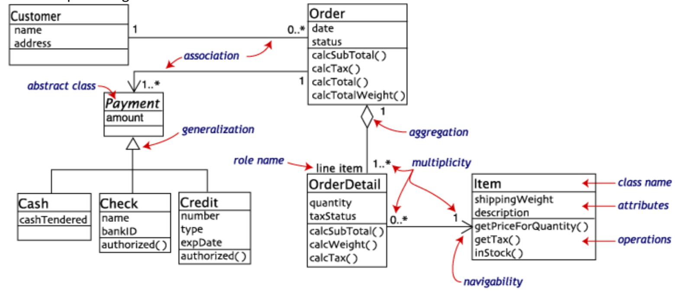
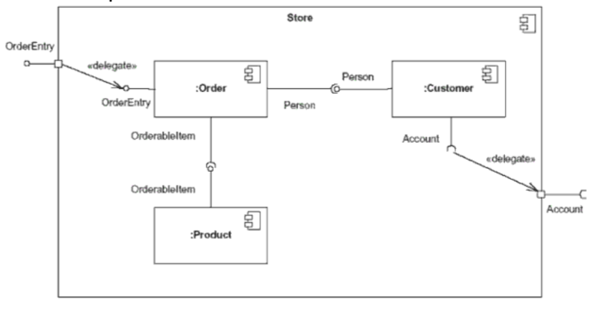
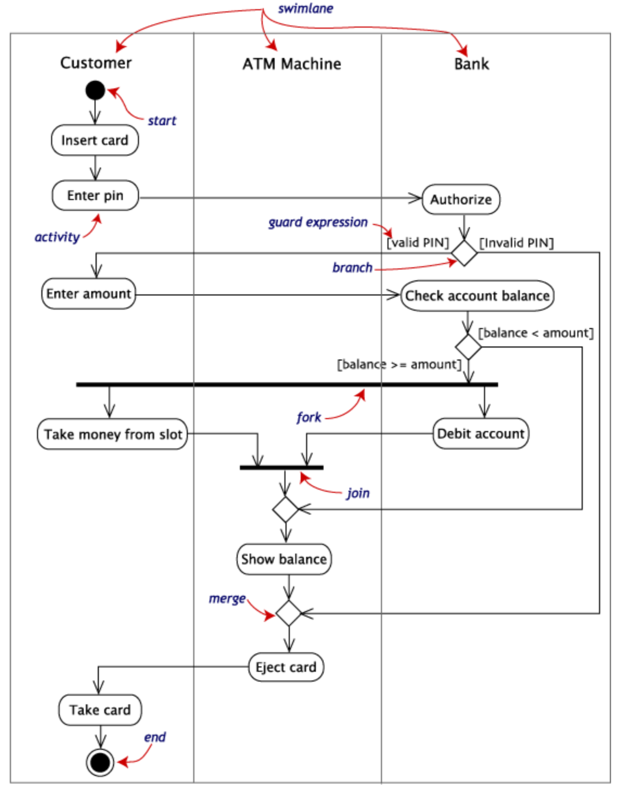
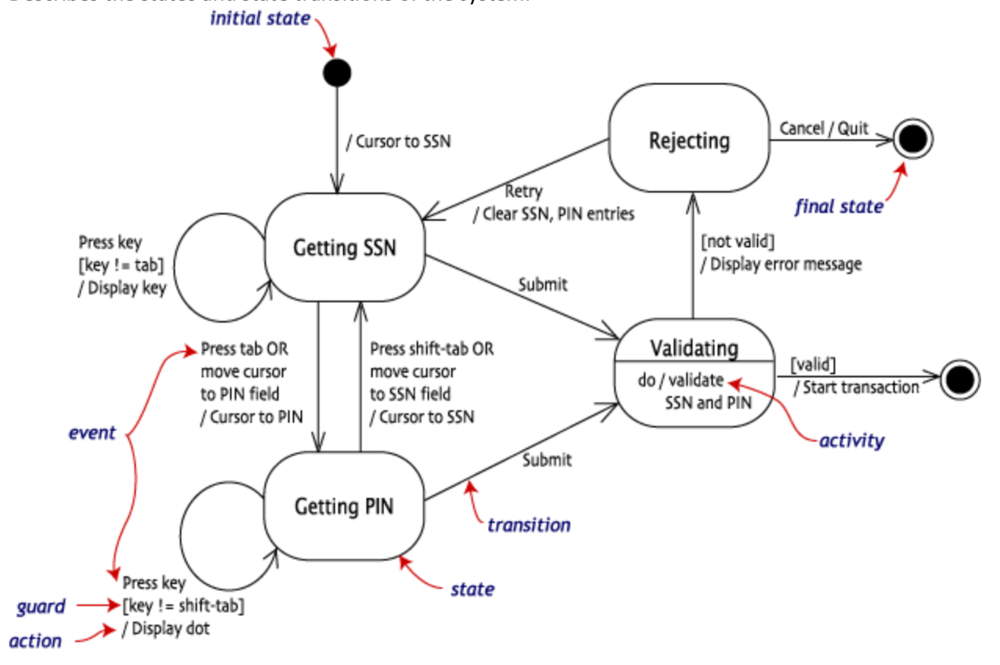
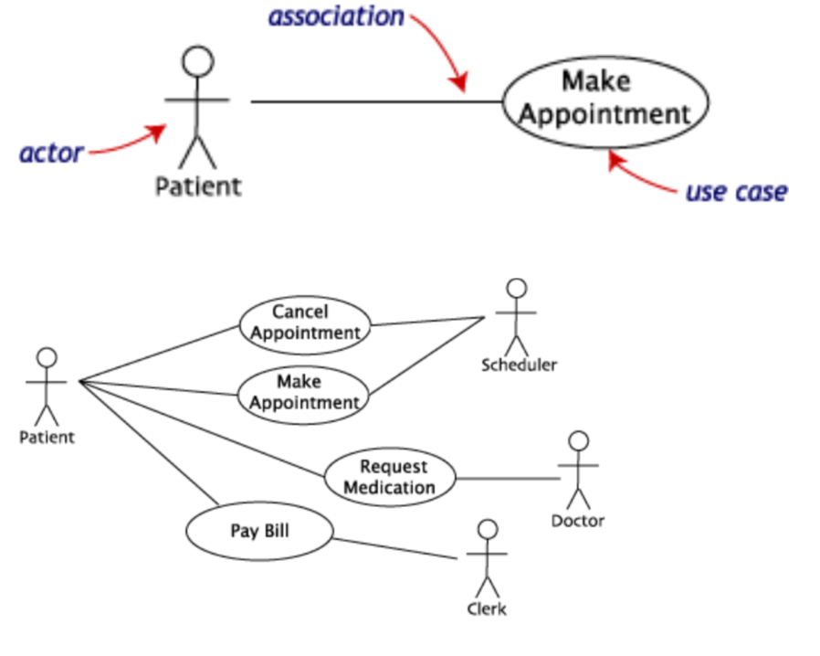
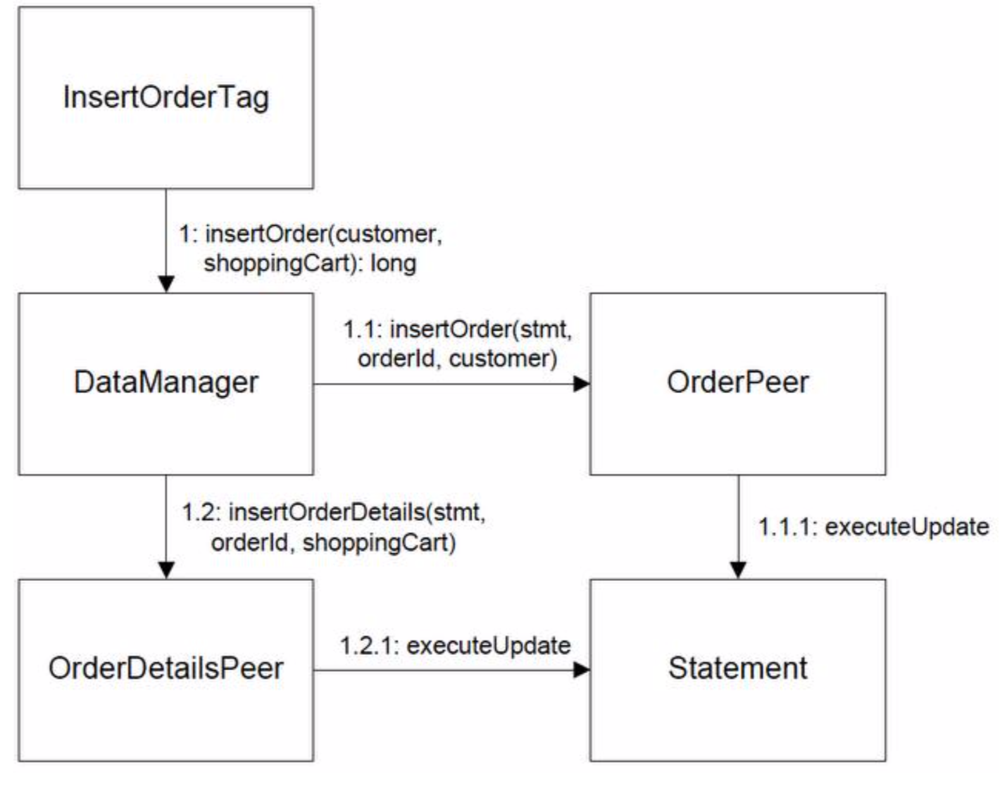
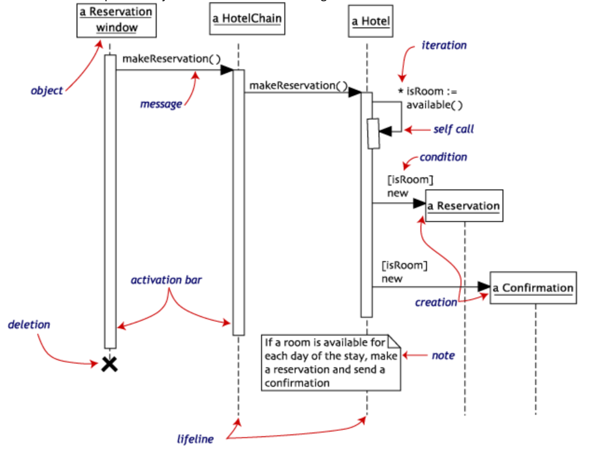

# Notes for the exam

# Development methods

## Waterfall model

Not very flexible. It flows in one direction, downwards like a waterfall. 
The main concept here is that you split development into phases, and once a phase is done, you move on to the next phase.

In Royce's original waterfall model, the following phases are followed in order:
1. System and software requrements: captured in a product requirements document.
2. Analysis: resulting in models, schema and business rules.
3. Design: resulting in the software architecture.
4. Coding: the development, proving and integration of software.
5. Testing: the systematic discovery and debugging of defects.
6. Operations: the installation, migration, support and maintenance of complete systems.

### Supporting arguments

Time spent early in the software production cycle can reduce costs at later stages. For example, a problem found in the early stages (such as requirements specification) is cheaper to fix than the same bug found later on in the process (by a factor of 50 to 200).

It puts emphasis on documentation and models, as these to a large degree need to be present before coding starts.

The approach is also very structured and easy to wrap your head around. The teams focus is very clear as each phase has a distinct focus. 

It might also the more clear to the customer how far the product has come in to production by looking at which phase the development team is currently working in.

It is argued that the waterfall model can be suited to projects where requirements and scope are fixed, the product itself is firm and stable, and the technology is clearly understood.

### Criticism

The biggest flaw of the waterfall method is the fact that most customers usually don't really know what they want. The have a general idea, but that might quickly change as development moves forward. The waterfall method is very poor at adapting to such changing requirements.

## Fusion

## Rational Unified Process (RUP)

RUP is an iterative software development process framework.  It divides the development process into four distinct phases that each involve business modeling, analysis and design, implementation, testing, and deployment. The four phases are:
1. **inception** - The idea for the project is stated. The development team determines if the project is worth pursuing and what resources will be needed.
2. **Elaboration** - The project's architecture and required resources are further evaluated. Developers consider possible applications of the software and costs associated with the development.
3. **Construction** - The project is developed and completed. The software is designed, written, and tested.
4. **Transition** - The software is released to the public. Final adjustments or updates are made based on feedback from end users. 

The RUP development methodology provides a structured way for companies to envision create software programs. Since it provides a specific plan for each step of the development process, it helps prevent resources from being wasted and reduces unexpected development costs.

The Rational Unified Process is structured around six fundamental best-practices, which are so-named due to their common use throughout the inustry:

- **Develop Software Iteratively**: Encourages iterative development by locating and working on the high-risk elements within every phase of the software development life cycle.
- **Manage Requirements**: Describes how to organize and keep track of functionality requirements, documentation, tradeoffs and decisions, and business requirements.
- **Use Component-Based Architectures**: Emphasizes development that focuses on software components which are reusable through this project and, most importantly, within future projects.
- **Visually Model Software**: Based on the Unified Modeling Language (UML), the Rational Unified Processprovides the means to visually model software, including the components and their relationships with one another.
- **Verify Software Quality**: Assists with design, implementation, and evaluation of all manner of tests throughout the software development life cycle.
- **Control Changes to Software**: Describes how to track and manage all forms of change that will inevitably occur throughout development, in order to produce successful iterations from one build to the next.

## Agile Modeling

Agile Modeling (AM) is a practices-based software process whose scope is to describe how to model and document in an effective and agile manner. The practices of AM should be used, ideally in whole, to enhance other, more complete software process such as eXtreme Programming (XP), the Rational Unified Process (RUP), Disciplined Agile Delivery (DAD), and the Enterprise Unified Process (EUP) to name a few.

### Core practices

**Documentation**
- Document continuously. Documentation is made throughout the life-cycle, in parallel to the creation of the rest of the solution.
- Document late. Documentation is made as late as possible, avoiding speculative ideas that are likely to change in favor of stable information.
- Executable specifications. Requirements are specified in the form of executable "customer tests", instead of non-executable "static" documentation.
- Single-source information. Information (models, documentation, software), is stored in one place and one place only, to prevent questions about what the "correct" version / information is.

**Modeling**
- Active stakeholder participation. Stakeholders of the solution/software being modelled should be actively involved with doing so. This is an extension of the on-site customer practice from Extreme Programming.
- Architecture envisioning. The team performs light-weight, high-level modeling that is JBGE at the beginning of a software project so as to explore the architecture strategy that the team believes will work.
- Inclusive tools. Prefer modelling tools, such as whiteboards and paper, that are easy to work with (they're inclusive).
- Iteration modeling. When a requirement/work item has not been sufficiently explored in detail via look-ahead modeling they team may choose to do that exploration during their iteration/sprint planning session. The need to do this is generally seen as a symptom that the team is not doing sufficient look-ahead modeling.
    Just barely good enough (JBGE). All artifact, including models and documents, should be just sufficient for the task at hand. JBGE is contextual in nature, in the case of the model it is determined by a combination of the complexity of whatever the model describes and the skills of the audience for that model.
- Look-ahead modeling. An agile team will look down their backlog one or more iterations/sprints ahead to ensure that a requirement/work item is ready to be worked on. Also called "backlog grooming" or "backlog refinement" in Scrum.
- Model storming. A short, often impromptu, agile modeling session. Model storming sessions are held to explore the details of a requirement or aspect of your design.
- Multiple models. Agile modelers should know how to create a range of model types (such as user stories, story maps, data models, Unified Modeling Language (UML) diagrams, and more) so as to apply the best model for the situation at hand.
- Prioritized requirements. Requirements should be worked on in priority order.
- Requirements envisioning. The team performs light-weight, high-level modeling that is JBGE at the beginning of a software project to explore the stakeholder requirements.

### Limitations

There is a significant dependence on personal communication and customer collaboration. Agile modeling can be dificult to apply
- On large teams without adequate tooling support
- Where team members are unable to share and collaborate on models
- When modeling skills are weak or lacking

## Agile

Agile is the ability to create and respond to change. It is a way of dealing with, and ultimately succeding in, an uncertain and turbulent environment.

Agile software development is an umbrella term for a set of frameworks and practices based on the values and principles expressed in the Manifesto for AGile Software Development and the 12 Priciples behind it.

Agile development breaks down some classical principles in workflow. The managers are much less hands-on than in traditional workflows. The managements role in agile development is to create a good environment where the team will thrive and come up with good solutions.

The teams are not labeled and seperated into different tasks as much a normal. The teams are much more diverse and able to handle all manor of tasks, not just one specific field.

This lack of strict roles in a team allows anyone to work any task. So if the frontend needs a bug sorted out, the development does not need to wait for the frontend team/person to finish their current task, anyone can go in and fix the bug. This allows the team to adapt more quickly than team using a more traditional and role-based system.

In an agile environment the developers will have a pretty close relationship with the customer. This is so that the customer can provide feedback during development and the team can implement new features or changes that the customer might want after development has started.

### Agile manifesto

We are uncovering better ways of developing
software by doing it and helping others do it.
Through this work we have come to value:

Individuals and interactions over processes and tools
Working software over comprehensive documentation
Customer collaboration over contract negotiation
Responding to change over following a plan

That is, while there is value in the items on
the right, we value the items on the left more.

### Principles behind the Agile Manifesto

- Our highest priority is to satisfy the customer
through early and continuous delivery
of valuable software.

- Welcome changing requirements, even late in
development. Agile processes harness change for
the customer's competitive advantage.

- Deliver working software frequently, from a
couple of weeks to a couple of months, with a
preference to the shorter timescale.

- Business people and developers must work
together daily throughout the project.

- Build projects around motivated individuals.
Give them the environment and support they need,
and trust them to get the job done.

- The most efficient and effective method of
conveying information to and within a development
team is face-to-face conversation.

- Working software is the primary measure of progress.

- Agile processes promote sustainable development.
The sponsors, developers, and users should be able
to maintain a constant pace indefinitely.

- Continuous attention to technical excellence
and good design enhances agility.

- Simplicity--the art of maximizing the amount
of work not done--is essential.

- The best architectures, requirements, and designs
emerge from self-organizing teams.

- At regular intervals, the team reflects on how
to become more effective, then tunes and adjusts
its behavior accordingly.

## eXtreme Programming

Extreme programming is all about customer satisfaction, and achieves this by providing the software you need, as you need it. Extreme programming empowers developers to confidently respond to changing customer requirements, even late in the life cycle.

Extreme Programming emphasizes teamwork. Managers, customers, and developers are all equal partners in a collaborative team. Extreme Programming implements a simple, yet effective environment enabling teams to become highly productive. The team self-organizes around the problem to solve it as efficiently as possible. 

Extreme Programming improves a software project in five essential ways; communication, simplicity, feedback, respect, and courage. Extreme Programmers constantly communicate with their customers and fellow programmers. They keep their design simple and clean. They get feedback by testing their software starting on day one. They deliver the system to the customers as early as possible and implement changes as suggested. Every small success deepens their respect for the unique contributions of each and every team member. With this foundation Extreme Programmers are able to courageously respond to changing requirements and technology.

### Rules of eXtreme Programming

**Planning**

- User Stories User stories are written.
- Release planning creates the release schedule.
- Make frequent small releases.
- The project is divided into iterations.
- Iteration planning starts each iteration.

**Managing**

- Give the team a dedicated open work space.
- Set a sustainable pace.
- A stand up meeting starts each day.
- The Project Velocity is measured.
- Move people around.
- Fix XP when it breaks.

**Designing**

- Simplicity
- Choose a system metaphor.
- User CRC cards for design sessions.
- Create spike solutions to reduce risk.
- No functionality is added early.
- Refactor whenever and wherever possible.

**Coding**

- The customer is always availible.
- Code must be written to agreed standards.
- Code the unit test first.
- All production code is pair programmed.
- Only one pair integrates code at the time.
- Integrate often.
- Set up a dedicated integration computer.
- Use collective ownsership.

**Testing**

- All code must have unit tests.
- All code must pass all tests before it can be released.
- When a bug is found tests are created.
- Acceptance tests are run often and the score is published.

### XP Flow

## SCRUM
Scrum is a framework within which people can address complex problems, while productively and creatively delivering products of the highest quality.

Scrum is:
- Lightweight
- Simple to understand
- Difficult to master

Scrum is not a process, technique, or definitive method. Rather, it is a framework within which you can employ various processes and techniques.

### Scrum values

When the values of commitments, courage, focus, openness and respect are embodied and lived by the Scrum team, the Scrum pillars of transparency, inspection, and adaptation come to life and build trust for everyone. The Scrum team members learn and explore those values as they work with Scrum events, roles and artifacts.

### The Scrum Team

The Scrum team consists of a Product Owner, the Developments Team, and a Scrum Master. The teams are self-organized and cross-functional. Self-organizing teams choose how best to accomplish their work, rather than being directed by others outside the team. Cross-functional teams have all competencies needed to accomplish the work without depending on others outside the team.

Scrum Teams deliver products iteratively and incremantally, maximizing opportunites for feedback. Incremental deliveries of "Done" product ensure a potentially useful version of the product is always awalible.

### The Product Owner

The Product Owner is responsible for maximizing the value of the product resulting from the work of the development team.

The Product Owner is the sole person responsible for managing the Product Backlog. This includes tasks such as:
- Clearly expressing Product Backlog items
- Ordering the items in the Product Backlog to best achieve goals and missions
- Optimizing the value of the work the development team performs
- Ensuring that the Product Backlog is visible, transparent, and clear to all, and shows what the Scrum Team will work on next
- Ensuring the Development Team understands items in the Product Backlog to the level needed

### The Development Team

Consists of professionals who do the work delivering a potentially releasable increment of "Done" product at the end of each Sprint.

Development Teams have the following characteristics:
- They are self-organizing. No one tells them how to turn the Product Backlog into Increments of potentially releasable functionality.
- They are cross-functional, with all the skills as a team necessary to create a product Increment.
- Scrum recognizes no titles for the members, regardless of the work being performed by the person.
- There are no sub-teams.
- Individual team memebrs may have spezialized skills or areas of focus, but accountability belongs to the team as a whole.

The Development Team should have a size of about 3-9.

### The Scrum Master

The Scrum Master is responsible for promoting and supporting Scrum as defined in the Scrum guide. Scrum Masters do this by helping everyone understand Scrum theory, practices, rules, and values.

The Scrum Master is a servant-leader for the Scrum Team. The Scrum Master helps those outside the Scrum Team understand which of their interactions with the Scrum Team are helpful and which aren't. The Scrum Master helps everyone change these interactions to maximize the value created by the Scrum Team.

The Scrum master is in service to the Product Owner, the Development Team and the Organization.

The Scrum master serves the Product Manager by for example:
- Ensuring that goals, scope, and product domain are understood bye everyone on the Scrum Team as well as possible;
- Finding techniques for effective Product Backlog managment;
- Helping the Scrum Team understand the need for clear and concise Product Backlog items;
- Understanding product planning in an empirical environment;
- Ensuring the Product Owner knows how to arrange the Product Backlog to maximize value;
- Undertanding and pricticing agility;
- Facilitating Scrum events as requested or needed.

The Scrum Master serves the Development Team is several ways, including:
- Coaching the Development Team in self-organization and cross-functionality;
- Helping the Development Team to create high-value products;
- Removing impediments to the Development Team's progress;
- Facilitating Scrum events as requested or needed;
- Coaching the Development Team in organizational environments in which Scrum is not fully yet adopted and understood.

The Scrum Master serves the organization on several ways, including:
- Leading and coaching the organization in its Scrum adoptaion;
- Planning Scrum implementations within the organization;
- Helping employees and stakeholders understand and enact Scrum and empirical product development;
- Causing change that increases the productivity of the Scrum Team;
- Working with other Scrum Masters to increase the effectiveness of the application of Scrum in the organization.

### Scrum  Events

Scrum has Events to create regualrity. The Events happens at a set regularity and have a predefined duration. The duration of an Events cannot be changed.

### The Sprint

The heart of Scrum is a Sprint, a time-box of one month or less during which a "Done", useable and potentially releasable product Increment is created.

Sprints contain and consist of the Sprint Planning, Daily Scrums, the development work, and the SPrint Retrospective.

During the Sprint:
- No changes are made that would endanger the Sprint Goal;
- Quality goals do not decrease;
- Scope may be clarified and re-negotiated between the Product Owner and Development Team as more is learned.

Each Sprint has a goal of what is to be buit, a design and flexible plan that will guide building it, the work, and the resultant product increment.

### Daily Scrum

This is a 15 minute time-boxed event where the Development Team reflect on what needs to be done in the next 24 hours. This is a daily event.

### Sprint Review

This is held at the end of each Sprint to inspect the Increment that has been made during this Sprint and make needed changes to the Product Backlog. This should be a meeting of no more than 4 hours for a month-long Sprint. It consists mostly of the Development Team presenting the Increment made during the Sprint, and the stakeholder providing feedback.

The result of the Sprint Review is a revised Product Backlog that defines the probable Product Backlog items for the next Sprint.

### Sprint Retrospective

The Sprint Retrospective is an opportunity for the Scrum Team to inspect itself and create a plan for improvements to be enacted during the next Sprint.

It occurs after the Sprint Review, but before the next Sprint Planning. The meeting should be at most 3 hours long.

The purpose of the Sprint Retrospective is to:
- Inspect how the last Sprint went with regards to people, relationships, process, and tools;
- Identify and order the major items that went well and potential improvements;
- Create a plan for implementing improvements to the way the Scrum Team does its work.

### Scrum Artifacts

Scrum’s artifacts represent work or value to provide transparency and opportunities for inspection and adaptation. Artifacts defined by Scrum are specifically designed to maximize transparency of key information so that everybody has the same understanding of the artifact.

### Product Backlog

The Product Backlog is an ordered list of everything that is known to be needed in the product. It is the single source of requirements for any changes to be made to the product. The Product Owner is responsible for the Product Backlog, including its content, availability, and ordering.

A Product Backlog is never complete. The earliest development of it lays out the initially known and best-understood requirements. The Product Backlog evolves as the product and the environment in which it will be used evolves. The Product Backlog is dynamic; it constantly changes to identify what the product needs to be appropriate, competitive, and useful. If a product exists, its Product Backlog also exists.

### Sprint Backlog

Essentially the same as a Product Backlog, except it only contains items that are to be completed during the current Sprint. The Sprint Backlog should contains items that will result in a new "Done" Increment of the product when completed.

### Increment

The Increment is the sum of all the Product Backlog items completed during a Sprint and the value of the increments of all previous Sprints. At the end of a Sprint, the new Increment must be "Done," which means it must be in useable condition and meet the Scrum Team’s definition of "Done". An increment is a body of inspectable, done work that supports empiricism at the end of the Sprint. The increment is a step toward a vision or goal. The increment must be in useable condition regardless of whether the Product Owner decides to release it.

## UML

Unified Modeling Language (UML) is a standardized general-purpose modeling language in the field of object-oriented software engineering. UML includes a set of graphic notation techniques to create visual models of object-oriented software systems.

UML diagrams represent two different views of a system model:

### Static (or structural) view

This view emphasizes the static structure of the system using objects, attributes, operations, and relationships. Ex: Class diagram, Composite Structure diagram.

### Dynamic (or behavioral) view

This view emphasizes the dynamic behavior of the system by showing collaborations among objects and changes to the internal states of objects. Ex: Sequence diagram, Activity diagram, State Machine diagram.

### Class diagram

Describes the structure of a system by showing the system's classes, their attributes, and the relationships among the classes.

### Component diagram

Describes how a software system is split-up into components and shows the dependencies among thesecomponents.

### Activity diagram

Describes the business and operational step-by-step workflows of components in a system. An activity diagram shows the overall flow of control.

### State Machine diagram

Describes the states and state transitions of the system.

### Use case diagram

Describes the functionality provided by a system in terms of actors, their goals represented as use cases, and any dependencies among those use cases.

### Communication diagrams

Shows the interactions between objects or parts in terms of sequenced messages. They represent a combination of information taken from Class, Sequence, and Use Case Diagrams describing both the static structure and dynamic behaviour of a system.

### Sequence diagram

Shows how objects communicate with each other in terms of a sequence of messages. Also indicates the lifespans of objects relative to those messages.

